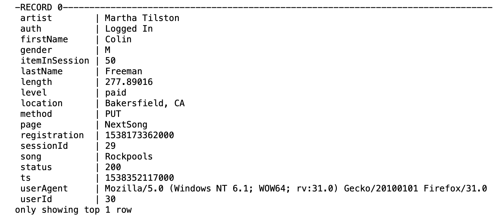
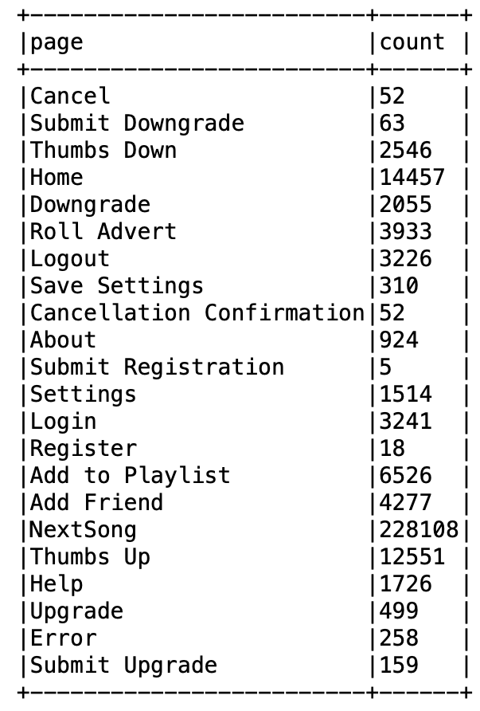
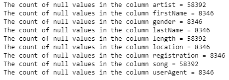
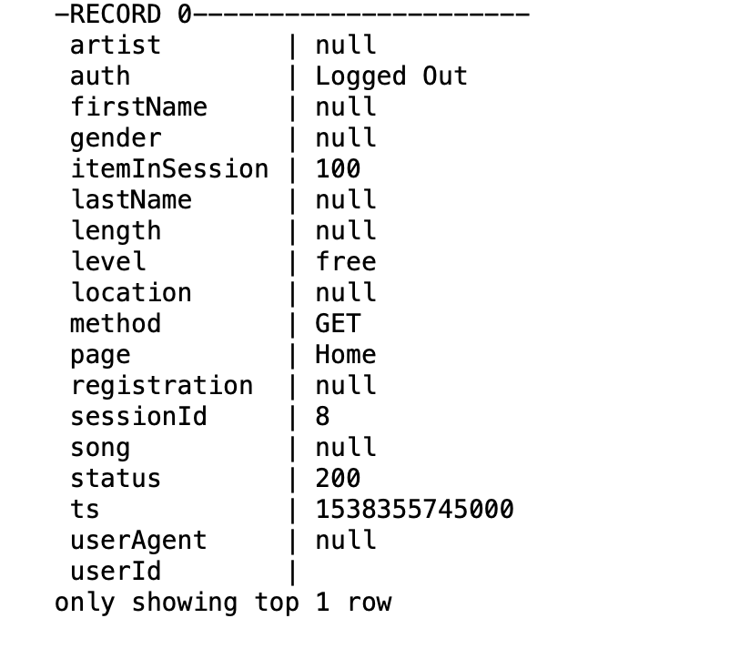
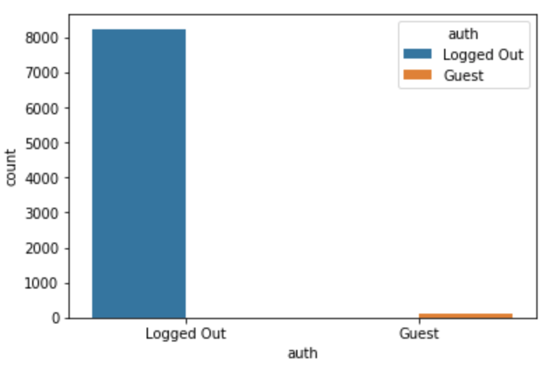

# Capstone-Project
# Spark Project: Sparkify
## Table of Contents

- [Introduction](#introduction)
  - [Project Overview](#overview)
  - [Problem Statement](#problem)
  - [Metrics](#metrics)
- [Analysis](#analysis)
  - [Data Exploration](#explore)
  - [Data Visualisation](#visualisation)
- [Methodology](#method)
  - [Data Preprocessing](#preprocessing)
  - [Implementation](#implement)
  - [Refinement](#refine)
- [Conclusion](#conclusion)
  - [Reflection](#reflect)
  - [Model Evaluation and Validation](#evaluation)
  - [Justification](#justification)
  - [Improvement](#improvement)
  - [Challenges](#challenges)
- [Files](#files)
- [Software Requirements](#requirements)
- [Acknowledgement](#acknowledgements)

***

## I. Introduction

### Project Overview
[Spotify](https://www.spotify.com/) is a Swedish music streaming and media services provider. 
The main project's  aim is to predict users churn for Sparkify (a Spotify-style  a mythical music service).
Like every Internet service Spotify makes money from user activity.
Sparkify's users perform different actions on the service pages. Project's data is a log file. It's mean that the data have more than one record for each user.
The project's full dataset is 12GB, of which you can analyze a mini subset is 128 MB (file mini_sparkify_event_data.json). 

### Problem Statement
The case solvation consists of:
- determine target to predict based on the information in 18th feature columns;
- predict users churn.

We should explore each dataset's column and find information about users decisions of churn. To perform this task we could select and aggregate the data from each column to determine which column consist of user's action to churn or not churn.

Finally, we have to create a column in the dataset that included information about user churn ('1') or not churn ('0') based on user's action in the dataset.

### Metrics

The dataser has only 225 unique users, 52 of them churned.
The dataset is unbalanced.
If we use accuracy to evaluate a model we will run into a case that
all predictions are churn or not churn.
We have to use F1-Score to
evaluate our model.

## II. Analysis

### Data Exploration

The shape of the dataset is 286500 rows and 18 columns.

The filled row shows:

The record display that the user Colin Freeman listened the song Rockpools by Martha Tilston. The dataframe is not a dataset. It is a part of log file. This datafame does not consist of any features could be using for prediction directly.
All of the dataframe columns are using to describe a user or a user action.
We can see the 18th columns in the dataframe and we have to determine which column contains the information about user churn. Actually, the columns listed below include information about:
* artist - a singer name or a group name;
* firstName - a user first name;
* gender - a user gender;
* itemInSession - some identificator or count;
* lastName - a user last name;
* length - in this case a length of a user sessions or a duration of the song;
* level - a free or paid account status;
* location - a user location;
* method - a http method;
* registration - a user registraion date;
* sessionId - a user session identificatior;
* song - a song name;
* status - a request status code response;
* ts - a user session timestamp;
* userAgent - a user browser type;
* userId - a user registration identificatior.

We have to explore dataframe columns.
And the first task is to determine target to predict.
Column 'page' have this information.

The visiting counts of the 'Cancel' and 'Cancellation Confirmation' are 52. These rows contain the information about churned users.

### Data Visualisation

All plots you can see at the appropriate part of a jupyter notebook.

## III. Methodology

### Data Preprocessing

1. Handling null values.

Initial dataset has null values in some columns.

 

We can see that columns 'firstName' and 'LastName' have 8346 null values. Furthermore, the column 'userAgent' includes the 8346 null values too. Nevertheless, the column 'userId' has not null values. We have to check the column 'userId' on invalid data, like an empty row.

An empty row looks like:

 
 
 We can see the 'Logged Out' value in the 'auth' column where the 'userId' column value is an empty row.
What the values does the 'auth' column include, except 'Logged Out'?

The plot show us that the 'auth' column consists of the 'Logged Out' and the 'Guest' values.
We can drop all rows with the 'Logged Out' and the 'Guest' values due to these rows are the audit records and have not the information about a user churn or any user activity.

The remained rows with null values we can not drop due to they have information to predict users churn.

2. Categorical features handling.

Some columns in tha dataset have categorical values. We have to change them to '0' and '1' values using 'dummy' columns.

3. Numerical features.

Each user has different count of listened song, completed sessions. We should create columns contained of users listened songs and completed sessions. These columns describe the users activity. We can call the columns as the first part users activity.

The second part users activity are the visited pages. As we saw earlier the users did not cancel a subscription visited more times the pages 'Add Friend', 'Add to Playlist', 'Save Settings', 'Submit Upgrade', 'Thumbs Up'. We can create some columns to store information about users activity on the pages.

Firstly, we create several pandas dataframes with count of visited pages. Secondly, we create the columns with agregated data in the spark dataframe. Thirdly, we recreate the spark dataframe and drop columns with raw categorical features.

### Implementation

[PySpark's MLlib](https://spark.apache.org//docs/latest/api/python/pyspark.ml.html) has the most common machine learning classification
algorithms. 
In the project we are using three of them:
- [Random Forest Classifier](https://spark.apache.org/docs/latest/ml-classification-regression.html#random-forest-classifier)
- [Logistic Regression](https://spark.apache.org/docs/latest/ml-classification-regression.html#logistic-regression)
- [Gradient Boosting Trees](https://spark.apache.org/docs/latest/ml-classification-regression.html#gradient-boosted-tree-classifier)

Firstly, I used all three algoriths with parameters by defalut.
In all cases, F1-score did not exceed 0.5.
I tried to change algoritms parameters. Ыo as not to iterate over the parameters manually, I read the Spark documentation of appropriated algoritms and tuned the parameters using ParamGridBuilder class.
For the Random Forest model, I changed the parameters 'impurity', 'maxDepth'. 

For the Logistic Regression, I varied the parameters 'elasticNetParam', 'regParam', 'maxIter', I altered the parameters 'maxIter', 'maxDepth'.

For the Gradient Boosting Trees, I altered the parameters 'maxIter', 'maxDepth'.

I have not experienced any difficulties with setting the parameters.

### Refinement

To improve used algorithms we can implement ParamGridBuilder and CrossValidator classes. One allow us to select the best parameters of our models, another to perform a validation process. I was finding parameters values which gave the best indicator F1-score.
Final parameters on each model determinated as the best parameters defined by ParamGridBuilder class.

F1-score was on average 0.2 less

## IV. Conclusion

### Reflection

The hardest part of the project was a prerpocessing the dataset. I was wandered that the initial dataset had not been a 'dataset'. It was not a spread of some features. The initial dataset was a part of log file that consisted users actifity.

I had to transform the project's data to dataset with unique user's records.

The second problem was the most dataset columns was not a feature columns. These columns included records that described user's sessions and actions.
And I wrangled the data and aggregated it.

### Evaluation

Random Forest model gives the best F1-score: 0.87.

Logistic Regression model take the second place with F1-score: 0.8.

Gradient-boosted tree is the worst model for the project, F1-score: 0.7.

We have only 225 rows in the dataset. It is too little to argue that the models gave the best results and no further configuration required.

 On the other hand, we got F1-score more over 0.8. I think that this is an acceptable result for the small dataset.

### Justification

In this project, I implemented a model to predict users churn for Sparkify music streaming service. 

I explored the data  to create features and unique users records  for the creating and evaluating the models. 

I evaluated 3 models: Random Forest (RF), Logistic Regression (LR), Gradient Boosted Trees (GBT).

I achived improving value of F1-score for all models by 0.2.

### Improvement

To improve a f1 score we should to perform the data to balanced dataset. We can use undersampling or oversampling methods.

### Challenges

The challenges which I run into in the project was:

- Spark documentation is not so good as compared to Pandas  or Scikit-learn;
- Spark implements only the most common machine learning  classification models instead of Scikit-learn;
- Umbalanced project's data lead to to a lower F1 score.

## V. Files

1. Folders 'images' consist of the images that you saw above.

2. The file Sparkify.ipynb is a jupyter notebook with full project's code.

## VI. Software Requirements

This project uses Python 3.6.5 and Spark, Pandas.

## VII. Acknowledgements

Thanks to Udacity for providing such a project to improve my Data Science skills.
